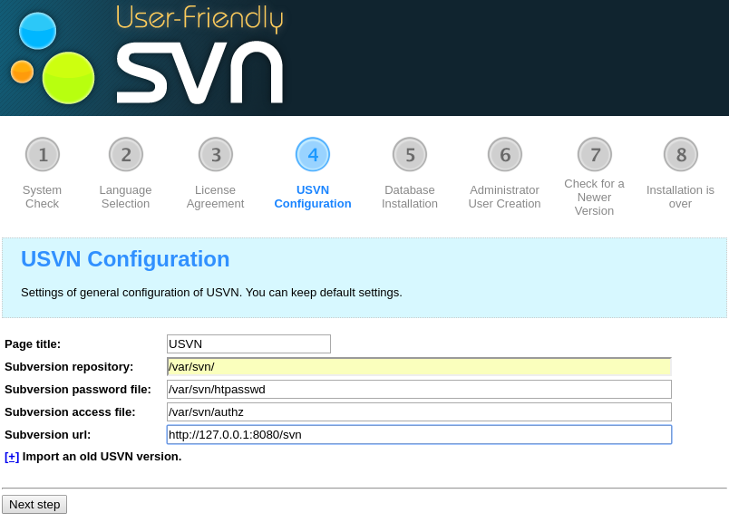
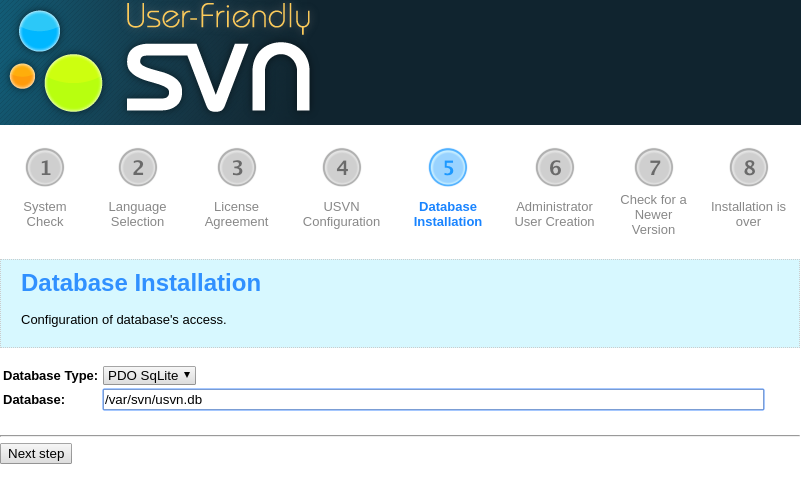

## SVN + Apache + Usvn  

**Requireds:** 

- **docker** and **docker-compose**  


**Installation:**  

You need to change volumes path in file docker-compose.yml for persistent.  

**Example:**

```yaml
volumes:  
  - /tmp/svn:/var/svn  
```
Where **/tmp/svn/** path on local machine.  

Next go to http://127.0.0.1:8080/install.php and follow by step.

Fill in the fields as shown below.






Site application http://www.usvn.info.
